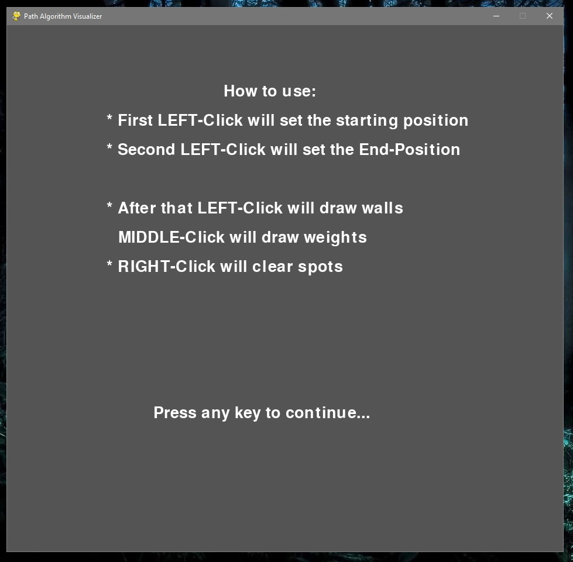
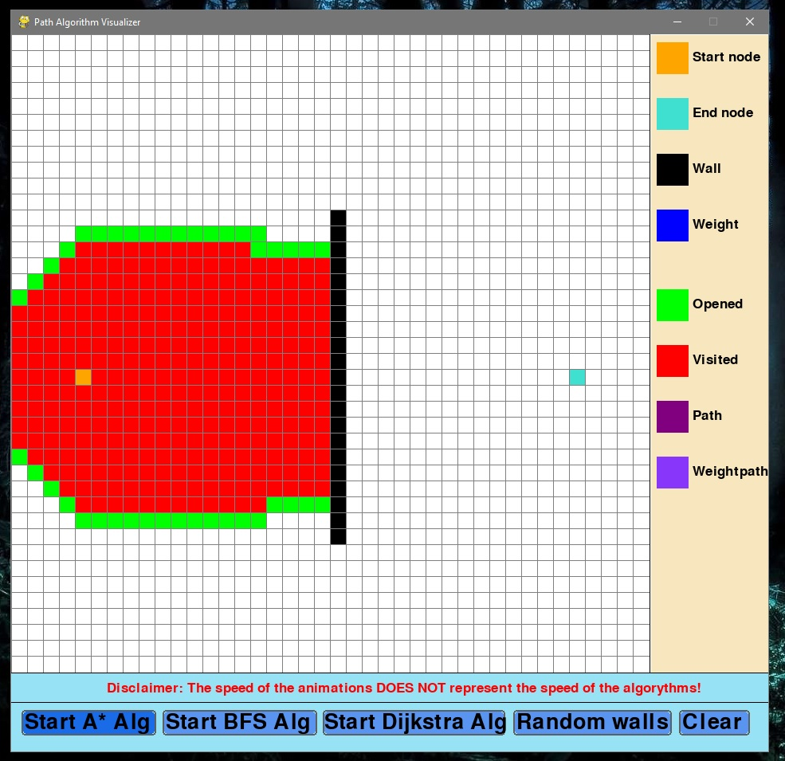
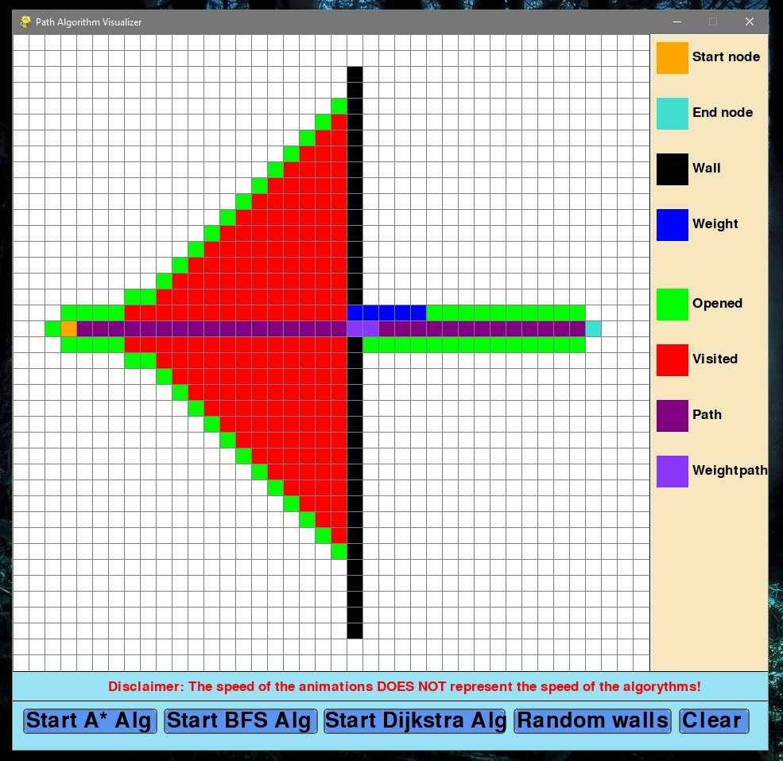
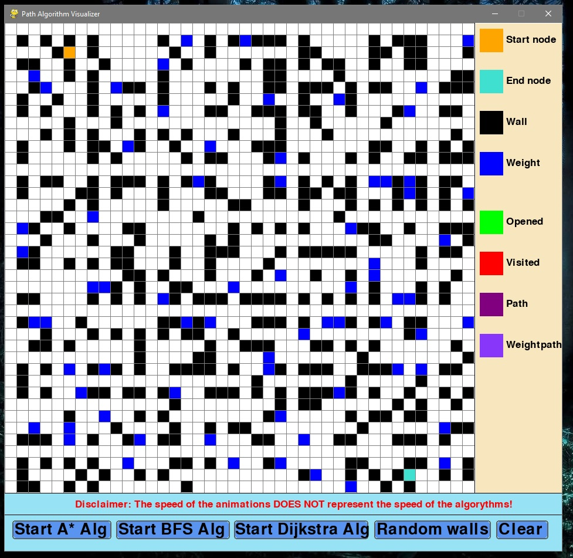
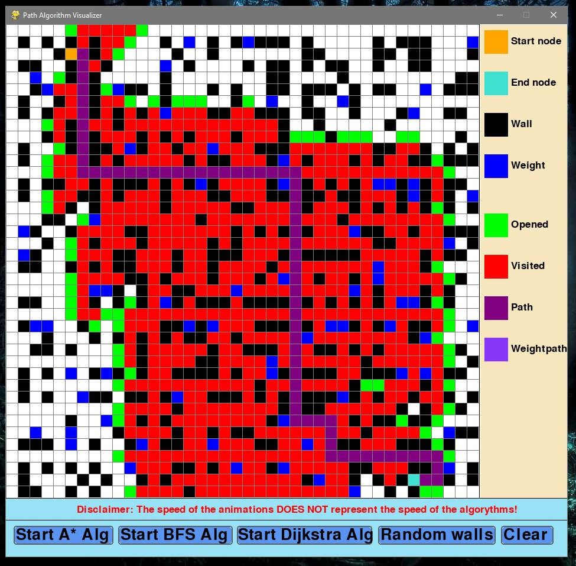

# PathfindingAlgorithm-Visualizer
Path Algorithm Visualizer programmed in python using pygame, math, random and queue modules.

Supports:
A*(Astar), BFS(Best-first-seach) and Dijkstra Algorithms

- allows "weighted"(loaded) paths
- visualizes the visited & unvisited nodes in real-time
- visualizes the path witch the algorithm has found
  - different coloring if the path includes weights
- create random walls(/w weights)

Check screenshots for further info

