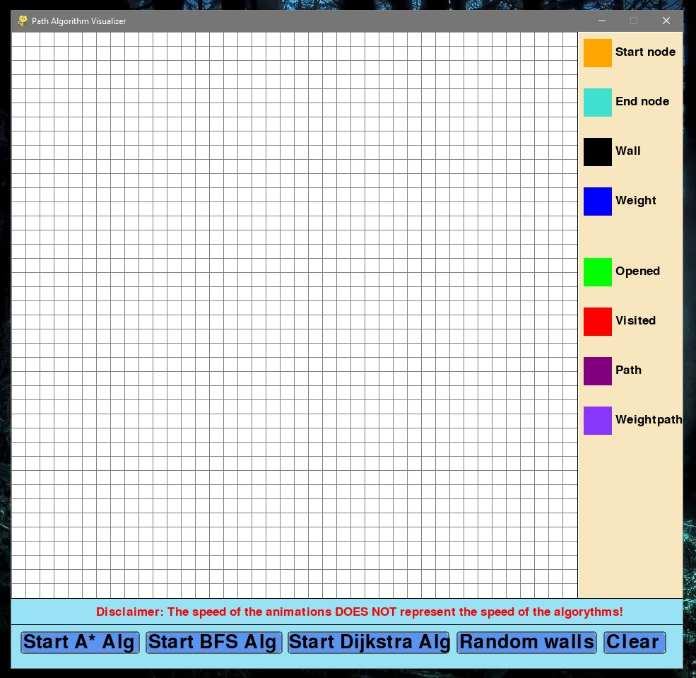

# PathfindingAlgorithm-Visualizer
Path Algorithm Visualizer programmed in python using pygame, math, random and queue modules.

Supports A*(Astar), BFS(Best-first-seach) and Dijkstra Algorithms.

- allows "weighted" paths

Check screenshots for further info

